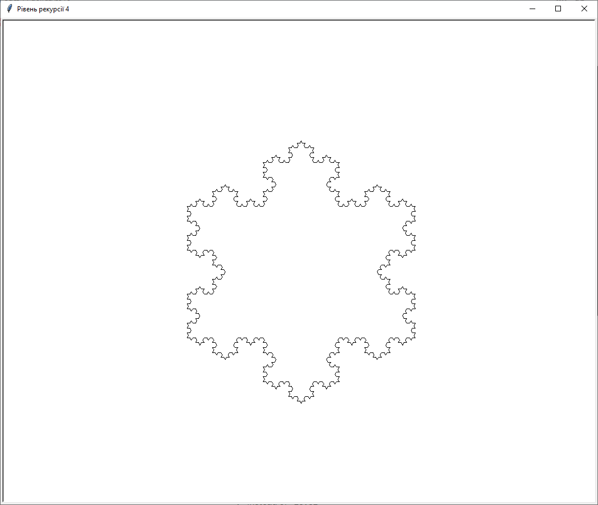
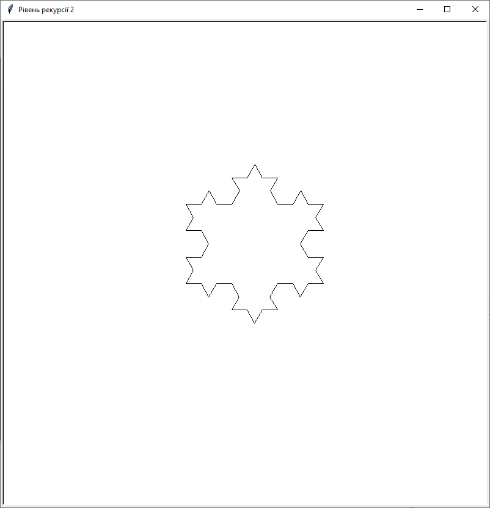
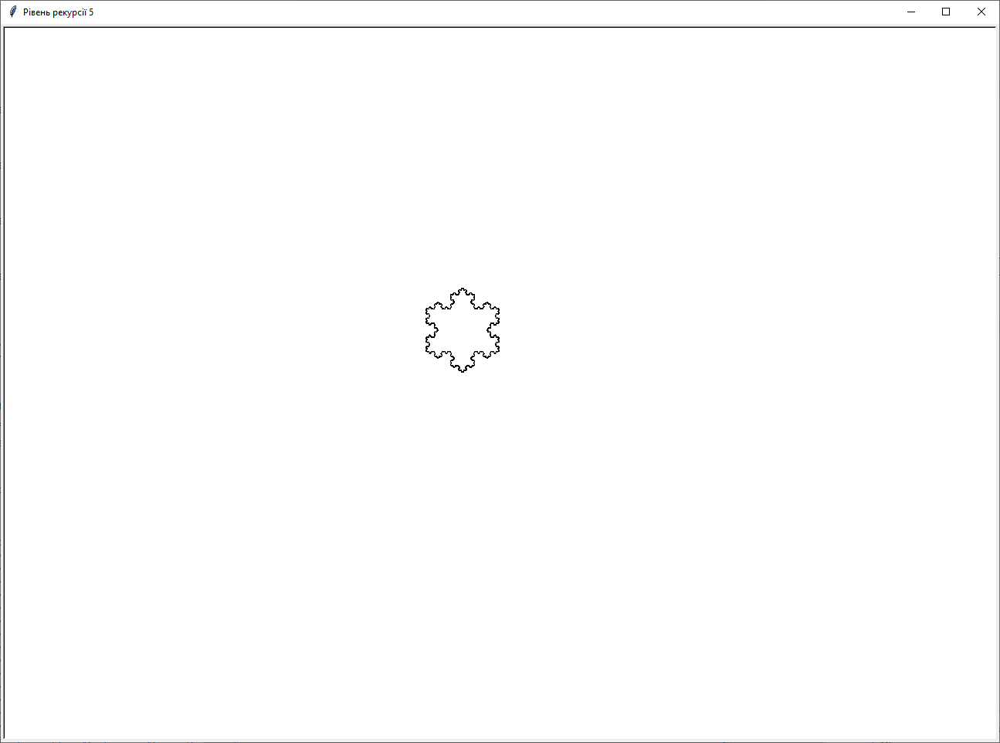

# Tasks

- task 1 - copy files from source directory to target recursively with creating sub dirs fo each file by extension
- task 2 - draw koch_snow with defined recursion level

## Task 1 

py.exe .\task1.py .\source_bob

## Task 2 samples

```python
.\task2.py 2
```



